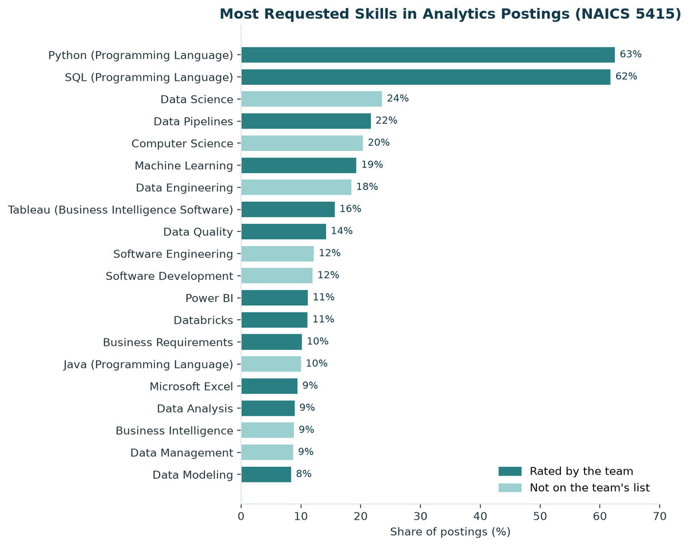

## <i class="bi bi-diagram-3"></i> Centralized Distribution Sourcing Strategy

**Prodrive Technologies | Professional | In progress**

**Objective.** Consolidate distribution procurement, currently managed by four regional procurement groups, into a single centralized function operating through one plant.

**Approach.** I am developing the sourcing strategy and the operating model that supports it. The work covers the commercial case for consolidation, the redesign of procurement processes and decision rights, and alignment with regional stakeholders and distribution partners.

**Expected outcome.** Greater economies of scale, consolidated purchasing power with distribution partners, and a consistent global approach to distribution sourcing.

**Competencies:** sourcing strategy, organizational and process design, supplier relationship management, stakeholder alignment

---

## <i class="bi bi-bar-chart-line"></i> Analytics Job Market and Skill Gap Analysis

**Boston University, AD 688 | Academic team project | Python, PySpark, scikit-learn, Quarto**

**Objective.** Evaluate career opportunities for analytics professionals in the computer systems design industry and identify the skills that candidates should prioritize.

**Approach.** From a source dataset of more than 500,000 job postings, the team constructed an analytical panel of 1,790 recent analytics roles. We measured employer demand by skill, benchmarked that demand against the team's own proficiency to produce a prioritized development plan, and built classification models to identify the factors associated with higher-paying roles. When the initial industry selection produced too few postings for reliable analysis, we revised the scope and documented the change.

{width=85% fig-alt="Bar chart of the most requested skills in analytics job postings. Python and SQL lead at 63 and 62 percent."}

**Outcome.**

- Python and SQL each appear in more than 60% of postings, well ahead of all other skills.
- The median advertised salary was $151,475, and 41% of postings offered remote or hybrid work.
- Job title alone identified higher-paying postings with 59% accuracy. A model incorporating skills, location, and education reached 78%.
- The skills most strongly associated with higher pay were not those most frequently requested.

[View the project on GitHub](https://github.com/JennaDer/METAD688_Group2){.btn .btn-outline-primary}

---

## <i class="bi bi-buildings"></i> New York City Real Estate Market Analysis

**Boston University | Academic team project | Python, Power BI**

**Objective.** Identify and explain residential market trends across New York City neighborhoods.

**Approach.** The team prepared and analyzed the data in Python and presented the results through interactive Power BI dashboards.

**Outcome.**

- A group of neighborhoods experienced sharp increases in residential prices.
- A second group tracked closely with industrial investment in the surrounding area.
- A third group continued to decline in value while population growth exceeded the capacity of the local housing stock.

---

## <i class="bi bi-clipboard-data"></i> In-House Brewery Business Case

**Boston University | Academic team project | Business case development**

**Objective.** Assess whether a pub should bring brewing in house to produce its own line of IPAs.

**Approach.** Over one semester, the team developed an end-to-end business case covering market positioning, marketing strategy, and the operational requirements of in-house production.

**Outcome.** The analysis supported the investment. Initial losses narrowed over the first several years, and in-house production strengthened the pub's community presence and supported longer-term market development.

**Competencies:** business case development, operations planning, marketing strategy