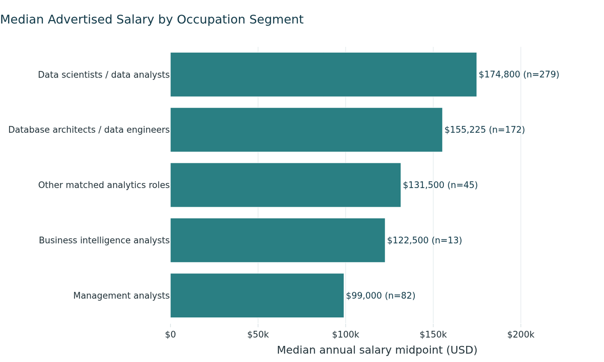
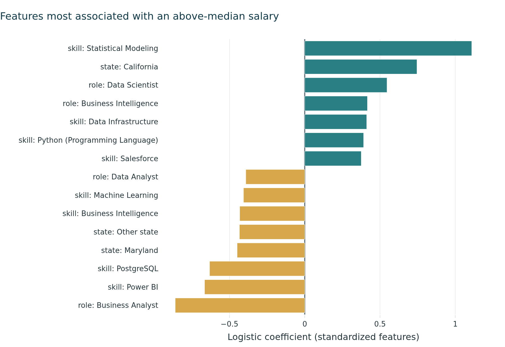

```{=html}
<section class="page-head"><span class="blob b1"></span><span class="blob b3"></span><div class="wrap" style="position:relative">
  <div class="kicker">Selected work</div>
  <h1 class="hero-title"><span class="line"><span>Projects, from the</span></span><span class="line"><span><em>plant floor</em> to Python.</span></span></h1>
  <p class="lead-text hero-sub">Professional and academic work in supply chain strategy and data analytics. Open any card for the detail.</p>
</div></section>

<section><div class="wrap proj-grid">

  <article class="proj wide reveal" data-tilt="3">
    <div class="proj-meta"><span>01 · Prodrive Technologies · Professional</span><span class="status live"><i></i>In progress</span></div>
    <h2>Centralized Distribution Sourcing Strategy</h2>
    <p>Consolidating distribution procurement, currently managed by four regional groups, into a single centralized function operating through one plant.</p>
    <div class="proj-stats"><div><b>4 → 1</b>procurement groups</div><div><b data-count="120" data-prefix="$" data-suffix="M">$120M</b>annual spend package</div></div>
    <div class="chips"><span>USA</span><span>Netherlands</span><span>Malaysia</span><span>China</span></div>
    <div class="chips"><span>Sourcing strategy</span><span>Organizational design</span><span>Process design</span><span>Supplier relationships</span><span>Stakeholder alignment</span></div>
    <details><summary>Details</summary><div>
      <p><strong>Objective.</strong> Consolidate distribution procurement into a single centralized function operating through one plant.</p>
      <p><strong>Approach.</strong> I am developing the sourcing strategy and the operating model that supports it. The work covers the commercial case for consolidation, the redesign of procurement processes and decision rights, and alignment with regional stakeholders and distribution partners.</p>
      <p><strong>Expected outcome.</strong> Greater economies of scale, consolidated purchasing power with distribution partners, and a consistent global approach to distribution sourcing.</p>
    </div></details>
  </article>

  <article class="proj wide reveal" data-tilt="2">
    <div class="proj-meta"><span>02 · Boston University, AD 688 · Team project</span><span class="status"><i></i>Delivered</span></div>
    <h2>Analytics Job Market and Skill Gap Analysis</h2>
    <p>From more than 500,000 job postings to a focused study of analytics roles in the computer systems design industry: what employers ask for, and what drives higher pay.</p>
    <div class="proj-stats"><div><b data-count="1790">1,790</b>roles analyzed</div><div><b data-count="78" data-suffix="%">78%</b>model accuracy</div><div><b data-count="63" data-suffix="%">63%</b>of postings ask for Python</div></div>
    <div class="chips"><span>Python</span><span>PySpark</span><span>scikit-learn</span><span>Plotly</span><span>Quarto</span></div>
    <div class="proj-gallery">
      <figure><a href="images/top_posting_skills.png"></a><figcaption>What employers ask for</figcaption></figure>
      <figure><a href="images/median_salary_by_occupation.png"></a><figcaption>What each role pays</figcaption></figure>
      <figure><a href="images/model_top_features.png"></a><figcaption>What drives higher pay</figcaption></figure>
    </div>
    <details><summary>Details</summary><div>
      <p><strong>Approach.</strong> The team constructed an analytical panel of recent analytics roles, measured employer demand by skill, benchmarked that demand against our own proficiency to produce a prioritized development plan, and built classification models to identify the factors associated with higher-paying roles. When the initial industry selection produced too few postings for reliable analysis, we revised the scope and documented the change.</p>
      <p><strong>Outcome.</strong></p>
      <ul>
        <li>Python and SQL each appear in more than 60% of postings, well ahead of all other skills.</li>
        <li>The median advertised salary was $151,475, and 41% of postings offered remote or hybrid work.</li>
        <li>Job title alone identified higher-paying postings with 59% accuracy. A model incorporating skills, location, and education reached 78%.</li>
        <li>The skills most strongly associated with higher pay were not those most frequently requested.</li>
      </ul>
      <a class="btn-pill ghost" href="https://github.com/JennaDer/METAD688_Group2">View on GitHub <i class="bi bi-arrow-up-right"></i></a>
    </div></details>
  </article>

  <article class="proj reveal" data-tilt="5">
    <div class="proj-meta"><span>03 · Boston University · Team project</span><span class="status"><i></i>Delivered</span></div>
    <h2>New York City Real Estate Market Analysis</h2>
    <p>Residential market trends across New York City neighborhoods, analyzed in Python and presented through Power BI dashboards.</p>
    <div class="chips"><span>Python</span><span>Power BI</span></div>
    <details><summary>Details</summary><div><ul>
      <li>A group of neighborhoods experienced sharp increases in residential prices.</li>
      <li>A second group tracked closely with industrial investment in the surrounding area.</li>
      <li>A third group continued to decline in value while population growth exceeded the capacity of the local housing stock.</li>
    </ul></div></details>
  </article>

  <article class="proj reveal" data-tilt="5" style="--d:.12s">
    <div class="proj-meta"><span>04 · Boston University · Team project</span><span class="status"><i></i>Delivered</span></div>
    <h2>In-House Brewery Business Case</h2>
    <p>A semester-long, end-to-end business case for a pub bringing brewing in house to produce its own line of IPAs.</p>
    <div class="chips"><span>Business case</span><span>Operations planning</span><span>Marketing strategy</span></div>
    <details><summary>Details</summary><div>
      <p>The team covered market positioning, marketing strategy, and the operational requirements of in-house production. The analysis supported the investment: initial losses narrowed over the first several years, and in-house production strengthened the pub's community presence and supported longer-term market development.</p>
    </div></details>
  </article>

</div></section>
```